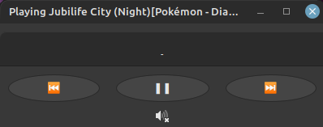

folder-player
=============

A GTK music player that automatically plays all the music in a folder, looping back to the beginning after all the songs are played. Has simple controls to go to the next and previous song and to adjust the volume.